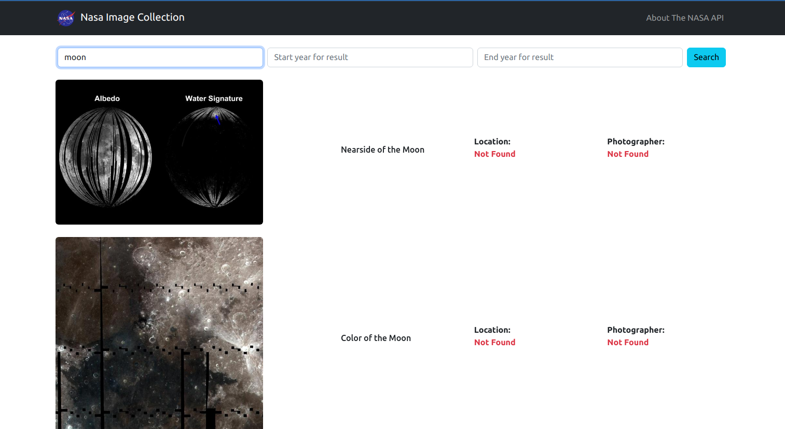
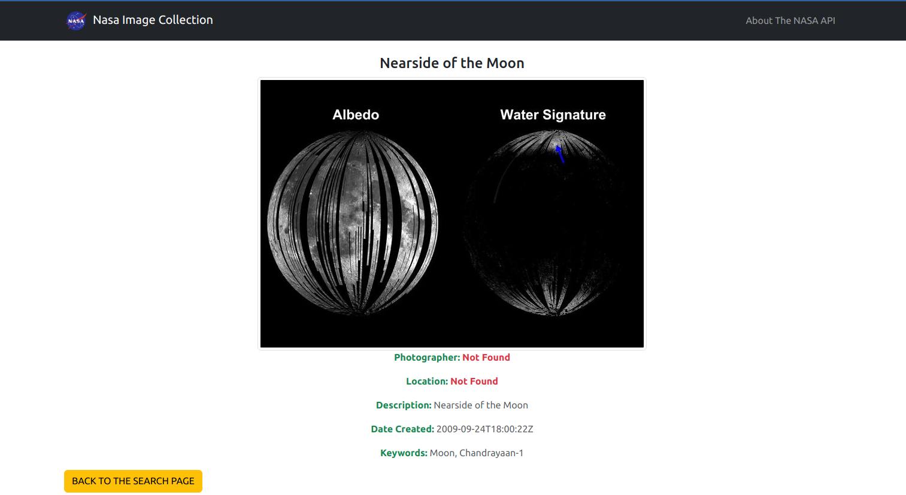
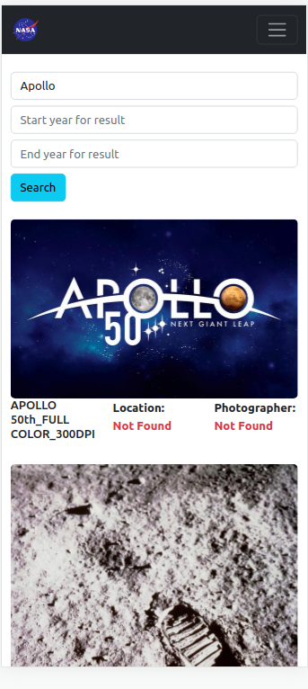
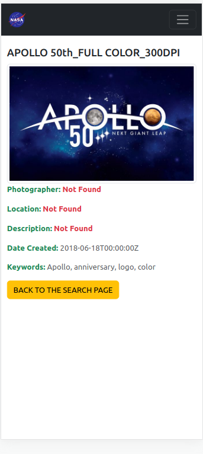

# NASA IMAGES COLLECTION

## Description
- This application include 2 pages: search and details.
- The page contain the required query input and 2 optional input(year start, year end) filters.
- The search results ([image collection from NASA API](https://images.nasa.gov/docs/images.nasa.gov_api_docs.pdf)) appear below the search section.
- Each search result item include a thumbnail, title, location, and photographer's name.
- The search result item's thumbnail has link to the detail page.
- The detail page contain: title, location, photographer's name, description, keywords, date, and original image from the collection.
- Click on the image for see the original image in the details page.






## Built With

- React
- Redux
- React-Bootstrap
- Reactstrap

## Live Demo
- [Nasa Images Collection](https://nasa-images-collection.netlify.app/)

## Setup
- Clone this project
```
- $ git clone https://github.com/ahmetbozaci/nasa-api.git
- $ cd nasa-api
```
- Install npm packages
```
- $ npm install
```
- Open website
```
- $ npm start
```
## Testing
```
- $ npm test
```
## Authors

👤 **Ahmet Bozacı**
- [Github](https://github.com/ahmetbozaci)
- [Twitter](https://twitter.com/ahmtbozaci)
- [LinkedIn](https://www.linkedin.com/in/ahmetbozaci/)


## 🤝 Contributing

Contributions, issues, and feature requests are welcome!

Feel free to check the [issues page](../../issues/).

## Show your support

Give a ⭐️ if you like this project!

## Acknowledgments
- React
- Redux
- React-Bootstrap
- Reactstrap
- [NASA API for image collection](https://images.nasa.gov/docs/images.nasa.gov_api_docs.pdf)
## 📝 License

* This project is [MIT](./LICENSE) licensed.